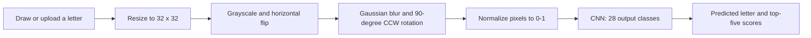

# Arabic Handwritten Character Recognition

**An interactive computer-vision project for classifying 28 isolated Arabic letters.**

Draw a letter or upload an image, then explore the predicted character and the five highest model scores. This academic project combines image preprocessing, a convolutional neural network, and a Streamlit interface.

**Stack:** Python · TensorFlow/Keras · OpenCV · Streamlit · NumPy · Matplotlib

## Why this problem?

Arabic letters can share a similar shape and differ only in the number or position of dots. Handwriting variation adds another challenge. The project investigates CNN-based recognition of **individual, isolated letters**; it does not perform word segmentation or full-document OCR.

## Try the application

The trained artifact `best.keras` is included in this repository.

```sh
git clone https://github.com/Hiba-mous/arabic-handwritten-character-recognition.git
cd arabic-handwritten-character-recognition
python -m venv .venv
```

Activate the environment:

```powershell
# Windows PowerShell
.\.venv\Scripts\Activate.ps1
```

```sh
# macOS / Linux
source .venv/bin/activate
```

Then install dependencies and launch:

```sh
python -m pip install -r requirements.txt
python -m streamlit run ProApp.py
```

Run from the repository directory so the app can find `best.keras`. Draw a light stroke on a dark background to match the default canvas.

**Environment status:** dependency versions are not locked, and a fresh-install run has not yet been verified. The original interface uses `st.experimental_rerun()` and older Streamlit image arguments; compatibility may require adjustment. The saved model metadata records Keras 3.9.2.

## From drawing to prediction



The application constructs an input tensor of shape `(1, 32, 32, 1)`. Orientation transformations are fixed operations in the code, not automatic orientation detection. The displayed confidence is a model score, not measured test accuracy.

## Model architecture

The following describes the configuration inside the **published `best.keras` artifact**, inspected without running inference:

| Stage | Saved configuration |
| --- | --- |
| Input | 32 × 32 × 1 grayscale image |
| Feature block 1 | Three Conv2D layers, 32 filters each, 5 × 5 kernels, ReLU; MaxPooling 2 × 2; BatchNormalization |
| Feature block 2 | Three Conv2D layers, 64 filters each, 5 × 5 kernels, ReLU; MaxPooling 2 × 2; BatchNormalization |
| Classifier | Flatten → Dense 128/ReLU → Dense 128/ReLU → Dropout 0.4 |
| Output | Dense 28, softmax |
| Saved compilation | Adam, learning rate approximately 0.001; categorical cross-entropy; accuracy |

**Version distinction:** the project report describes a different architecture: three blocks with double 3 × 3 convolutions and dropout rates of 0.25/0.5. The relationship between that experiment and this saved artifact has not yet been established. Reported experimental results below must therefore not be treated as verified performance of the published model.

## Results documented in the project report

Source: *Rapport de Mini-Projet Machine Learning — Reconnaissance de lettres arabes manuscrites par apprentissage profond*, academic year 2024–2025.

| Evidence | What the report shows | Scope |
| --- | --- | --- |
| Learning curves, Fig. 3.6, printed p. 35 | Approximately 98% training accuracy and 97% validation accuracy over 50 epochs | Approximate values from the report; not a new evaluation |
| Confusion matrix, Fig. 3.5, printed p. 34 | A strongly populated diagonal across 28 class indices, with some off-diagonal errors | The report labels this a test-set evaluation |
| Qualitative examples, Figs. 3.2–3.4, printed pp. 32–33 | Predictions on visually similar handwritten letters | Illustrative examples, not a robustness benchmark |

These figures provide evidence of the reported experiment, but do not establish calibration, absence of bias, or performance on new handwriting populations. No numerical precision, recall, or F1 result is claimed here.

## Dataset and reproducibility

The report discusses AHCD and other Arabic handwriting datasets in its background section. It does not unambiguously identify the exact training dataset/version, split indices, or writer-independent evaluation protocol for the published artifact. The presence of other datasets in local project folders is not sufficient to establish provenance.

Available in this repository:

- Streamlit inference interface and preprocessing.
- Saved Keras model.
- Dependency list and setup instructions.

Still needed to reproduce the reported experiments:

- Original training and evaluation notebook/scripts.
- Confirmed dataset source, license, label mapping, and train/validation/test splits.
- Random seeds, training configuration, and raw metric history.
- Confirmation of which checkpoint produced the report's figures.

The application source passed a Python syntax check, and the local model archive passed an integrity check. Its Git blob hash matches the uploaded model. These checks do not replace an application run or an accuracy evaluation.

## Project team and acknowledgments

Hiba Moussadek and Marwane Drissi worked together as a binôme on the CNN project.

The report cover credits **Marwane Drissi, Jamila Ouzane, Hibat Allah Moussadek, and Hiba Bensaid**. All report contributors are acknowledged; the report does not assign individual responsibilities.

**Supervisor:** Prof. Nabil Azouagh  
**Institution:** Faculty of Sciences and Techniques of Mohammedia, Hassan II University  
**Academic year:** 2024–2025

## Next steps

- Recover and publish the original training workflow and verified dataset metadata.
- Reconcile the report architecture with the saved checkpoint.
- Evaluate with held-out writers and inspect errors between similar letters.
- Lock a tested environment and add a small reproducible inference example.
